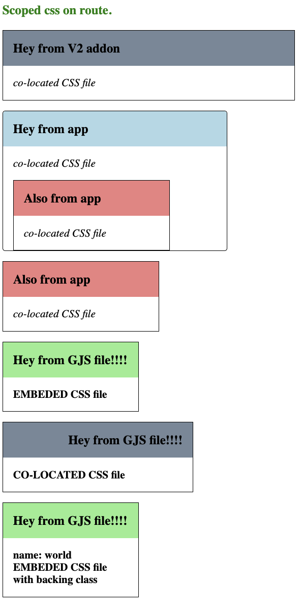

# ember-scoped-css

This app is an investigation of how to implement scoped CSS in Ember. It should work in classic Ember apps and Embroider apps with V2 addons.

## Latest results

  
  
  
  

### Embroider app

1. webpack `scoped-js-loader` is used for loading JS and GJS files. It does a few things:

   - if there is co-located CSS file it will add import to CSS file. `import './co-located.css'`
   - if it is GJS file it extracts and save co-located CSS file. (it will fire `scoped-css-loader` described below)
   - if there is a template in GJS file it rewrites classes in the template.

2. webpack `scoped-css-loader` is used for loading CSS files. It transforms CSS selectors to be scoped and puts all content of the CSS file to css layer `@layer components { ... }`.
3. webpack `scoped-hbs-loader` is used for loading HBS files. It rewrites classes in the template.

### V2 addon

In V2 addon is one rollup plugin `rollup-plugin-colocation` which does the same as `scoped-js-loader`, `scoped-css-loader` and `scoped-hbs-loader` in Embroider app. It will be split into 3 plugins but there was conflict with `addon.keepAssets(...)` in rollup config. I will solve it later.

### Background

The important thing is that the co-located styles are imported into JS files.
I believe that there is [`style-loader`](https://github.com/webpack-contrib/style-loader) set for development, which will inject the styles into the head as separate style tags for every CSS file (I have read somewhere that it is faster for development).
In production environment is used [`mini-css-extract-plugin`](https://github.com/webpack-contrib/mini-css-extract-plugin) which will extract all CSS files into one file and will inject link tag into the head.

### Next steps

1. try to implement all three loaders as unplugin and use them in Embroider app and V2 addon.

# NOTES from investigation

A custom-css-loader should discover `@import url('scoped-components.css')` in `app/styles/app.css`.
If the `scoped-components.css` is imported then the custom-css-loader will load and emit all co-located CSS files.

##

Problem is that `app/styles/app.css` is not imported to any JS file. So the custom-css-loader will not discover it.
There is probably used `CopyWebpackPlugin` to copy the `app/styles/app.css` to the dist folder directly. In this case the custom-css-loader will not discover it. (checking it by debugging embroider and searching where the webpack config is created)

> Note: I did not find how the `app/styles/app.css` is copied to the dist folder. If it was imported to some JS file then the custom-css-loader will discover imports inside it.

## 2. webpack plugin

I am going to create a webpack plugin which will discover all co-located CSS files and will emit them to the dist folder combined to one file `scoped-components.css`.

> Note: I couldn't resist to implement simple append logic for replacing css selectors.

## 3. hbs loader

I have found, that I can use hbs loader to load hbs files.

> Note: It was fun to implement replace logic based on info from css file.

## 4. CSS loader

Checking why I cannot use css loader to load css files. Looks like css files are somehow simply copied to the dist folder??? Loaders are not used.

I debugged embroider building process, and I have found pathToVanillaApp. This app is passed to webpack, so I am going to see how app.css is copied to the dist folder.

## 5. unplugin

1. Wrap everything in unplugin
2. Generate V2 addon with addon blueprint with co-located css (use unplugin in rolup config)
   And make sure when it is build the css is outputed in the build directory.
3. Import the V2 addon with the css to test-embroider-css-layers app

> Note: Unplugin was unnecessary complexity for such early stage of investigation. I have decided to use webpack plugin for embroider applications and rollup plugin for V2 addons.

## 6. Rollup plugin for V2 addons

V2 addons are built with rollup. rollup.config.js is there so it is not magic like in embroider applications where webpack config is missing. So I could play with rollup config and rollup plugin and see how it works.
